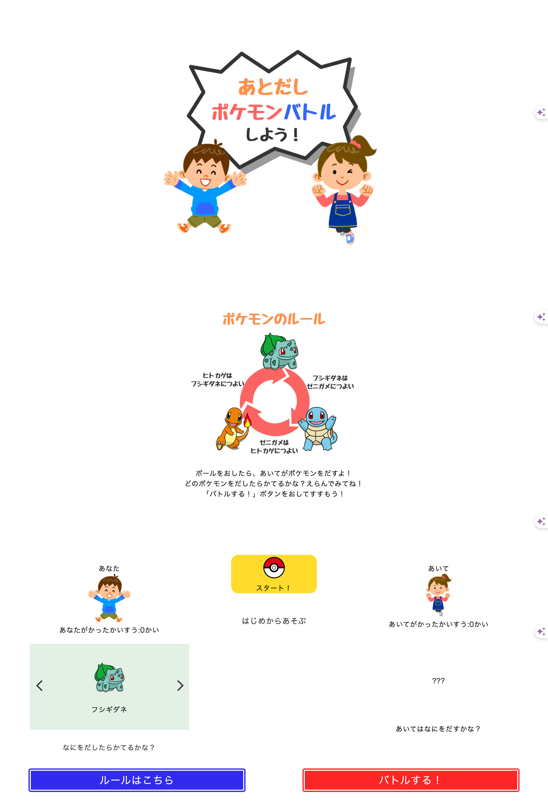

# ① 課題番号-プロダクト名

JS2 - じゃんけんアプリリッチ ver

## ② 課題内容（どんな作品か）

- javascript を使用したじゃんけんのアプリをパワーアップする

## ③DEMO

## ④ 工夫した点・こだわった点

- あとだしじゃんけんに変更した
- 勝ち負けの回数を表示できるようにした
- 誰でも遊びやすいようにルール説明を追加した

## ④ 難しかった点・次回トライしたいこと(又は機能)

- スライダーのコードの意味がまだ理解できていない…
- 参考のコードを見てもわからないところが多かった
- あとだしの勝敗のコードを書いている時に書き間違いが多かった

## ⑤ 質問・疑問・感想、シェアしたいこと等なんでも

- [質問] イベントリスナーについて知りたい
- [疑問]
- [感想] 他の方のコードなど見ても、知らない関数がたくさんでした。もっと勉強頑張ろうと思います！
- [tips] js だけでスクロールできる記事を見つけました。
- [参考記事] [指定位置までスクロール]https://tech.mychma.com/javascript-scroll/1938/

### おまけ（キャプチャー画像）

